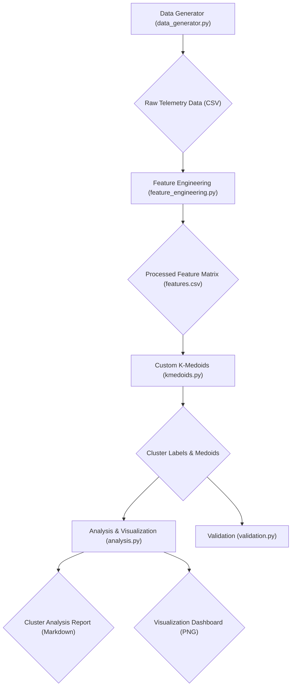

# K-Medoids Dogfight Analysis: Discovering Tactical Archetypes

This repository contains a complete, end-to-end data mining pipeline to discover "vulnerability archetypes" in modern air combat. The project uses a custom K-Medoids clustering algorithm to analyze synthetic telemetry data generated from a Python-based flight simulation environment.

## Visual Overview (Code & Logic Map)



## Quick Start

1.  **Clone the repository:**
    ```bash
    git clone https://github.com/liamheary/DataMining_K-Medoid_DogfightAnalysis.git
    cd DataMining_K-Medoid_DogfightAnalysis
    ```

2.  **Create and activate a virtual environment:**
    ```bash
    python3 -m venv .venv
    source .venv/bin/activate
    ```

3.  **Install the required packages:**
    ```bash
    pip install -r requirements.txt
    ```

4.  **Run the full pipeline:**
    ```bash
    # 1. Generate the raw data
    python3 src/data_generator.py

    # 2. Process the data and create the feature matrix
    python3 src/pipelines/feature_engineering.py

    # 3. Run the K-Medoids clustering algorithm
    python3 src/models/kmedoids.py

    # 4. Analyze the results and generate visualizations and reports
    python3 notebooks/analysis.py
    ```

## Knowledge Discovered: The Medoids

The K-Medoids algorithm has discovered three distinct tactical archetypes, each represented by a "medoid" (a real data point from the simulation that best represents the center of the cluster).

-   **Cluster 0: Low-Energy Defensive**: This cluster is characterized by low specific energy and a neutral or defensive position. This is a high-threat state, as the aircraft has limited maneuverability and is vulnerable to attack.

-   **Cluster 1: High-Energy Offensive**: This cluster is characterized by high specific energy and an advantageous position behind the opponent. This is a high-success state, as the aircraft has a significant energy advantage and is in a good position to attack.

-   **Cluster 2: Neutral/Transitional**: This cluster represents a neutral or transitional state, where the aircraft is neither at a significant advantage nor disadvantage. This is a common state in a dogfight, as the aircraft jockey for position.

For a more detailed analysis of the clusters, please see the [Cluster Analysis Report](data/processed/cluster_analysis_report.md).
