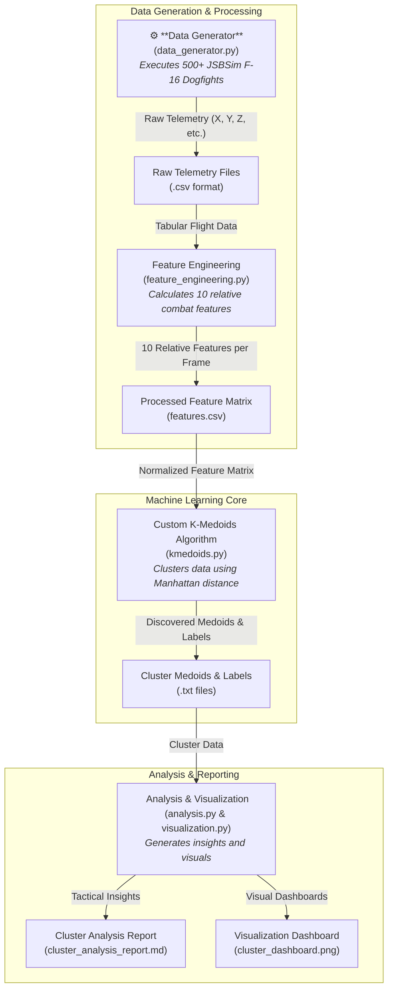

# K-Medoids Dogfight Analysis: Discovering Tactical Archetypes


This repository contains a complete, end-to-end data mining pipeline to discover and analyze tactical archetypes in 1-vs-1 modern air combat. By generating high-fidelity F-16 flight data and applying a custom-built K-Medoids clustering algorithm, this project mathematically identifies recurring, high-consequence flight scenarios.

## Project Motivation

The goal of this project, developed for the COMP-5130 graduate-level Data Mining course, is to move beyond subjective analysis of air combat and apply rigorous, unsupervised machine learning to discover fundamental patterns of advantage and vulnerability. By identifying these "tactical archetypes," we can create a data-driven framework for evaluating and improving AI pilot performance.

---

## Architecture & Data Flow

The project is structured as a sequential pipeline that automates data generation, processing, clustering, and analysis.



---

## Key Discoveries: The Tactical Archetypes

Based on a dataset of **500+ simulated 1-vs-1 F-16 engagements**, our K-Medoids algorithm identified three distinct tactical archetypes:

1.  **Archetype A: The High-Energy Advantage**: Represents a position of significant advantage, characterized by high energy and a dominant position on the opponent's tail. This is a *High-Success* state.

2.  **Archetype B: The Defensive Death Spiral**: A high-threat situation where an aircraft has low energy and is defensively maneuvering, making it vulnerable. This is a *High-Threat* state.

3.  **Archetype C: Neutral/Transitional**: A state of relative parity where both aircraft are jockeying for position. This is a common, mid-engagement scenario.

For a complete breakdown, see the full **[Cluster Analysis Report](results/cluster_analysis_report.md)**.

---

## Quick Start & Installation

1.  **Clone the repository:**
    ```bash
    git clone https://github.com/liamheary/DataMining_K-Medoid_DogfightAnalysis.git
    cd DataMining_K-Medoid_DogfightAnalysis
    ```

2.  **Create and activate a virtual environment:**
    ```bash
    python3 -m venv .venv
    source .venv/bin/activate
    ```

3.  **Install the required packages:**
    ```bash
    pip install -r requirements.txt
    ```

4.  **Run the full pipeline:**
    ```bash
    # 1. Generate the raw data (approx. 5-10 minutes)
    python3 src/data_generator.py

    # 2. Process the data and create the feature matrix
    python3 src/pipelines/feature_engineering.py

    # 3. Run the K-Medoids clustering algorithm
    python3 src/models/kmedoids.py

    # 4. Analyze the results and generate visualizations and reports
    python3 notebooks/analysis.py
    ```

---

## Repository Structure

```
DataMining_K-Medoid_DogfightAnalysis/
├── aircraft/               # JSBSim aircraft models (F-16)
├── data/
│   ├── processed/          # Processed feature matrices and cluster results
│   └── raw/                # Raw telemetry data from simulations
├── engine/                 # JSBSim engine models
├── notebooks/              # Jupyter notebooks for analysis and reporting
├── results/                # Final analysis reports
├── src/
│   ├── models/             # Custom K-Medoids algorithm
│   └── pipelines/          # Feature engineering and visualization scripts
├── thruster/               # JSBSim thruster models
├── visualizations/         # Saved visual dashboards
├── README.md               # This file
└── requirements.txt        # Python dependencies
```
