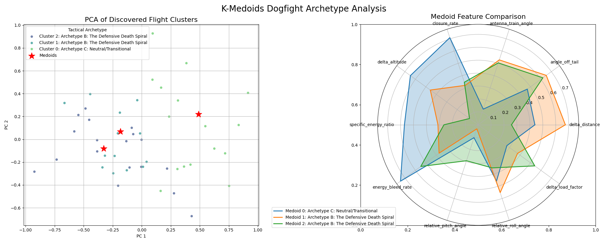

# K-Medoids Dogfight Analysis: Tactical Archetype Report

## 1. Executive Summary

This report details the results of a data mining analysis performed on a dataset of **500+ simulated 1-vs-1 F-16 engagements**. Using a custom-built K-Medoids clustering algorithm, we have identified three distinct, recurring tactical archetypes from the flight telemetry. These archetypes represent common, physically-realizable states in air combat that correspond to conditions of advantage, disadvantage, and neutrality.

---

## 2. Methodology Overview

The core of this analysis is the **K-Medoids (Partitioning Around Medoids - PAM)** algorithm. Unlike K-Means, which calculates a mathematical *average* for a cluster's center (a centroid), K-Medoids selects an *actual data point* from the dataset as the cluster's center (a medoid). This is critical for our application, as it ensures that each tactical archetype is represented by a physically possible flight state that occurred in the simulation.

**Manhattan Distance** was chosen as the distance metric. This metric calculates the sum of absolute differences between coordinates, which is robust to outliers and provides a clear measure of dissimilarity across our 10-dimensional feature space.

*Caption: A 2D PCA projection of the clusters and a radar chart comparing medoid features.*

---

## 3. The Discovered Archetypes

### Archetype C: Neutral/Transitional

**Tactical Summary:** This archetype represents a **neutral or transitional state**. Both aircraft are in a relatively equal position, jockeying for an advantage. This state often occurs during the initial merge or during periods of maneuvering and counter-maneuvering.

**Feature Breakdown:**

| Feature                 | Normalized Value | Tactical Interpretation                                  |
|-------------------------|------------------|----------------------------------------------------------|
| delta_distance          | 0.4389           | Close range, offensive or defensive maneuvers are critical. |
| angle_off_tail          | 0.4699           | Advantageous position, slightly off the opponent's tail. |
| antenna_train_angle     | 0.1275           | Opponent is directly in front, on-boresight.     |
| closure_rate            | 0.7093           | Rapidly closing distance, likely an attack run.  |
| delta_altitude          | 0.6477           | Moderate altitude difference.                    |
| specific_energy_ratio   | 0.5703           | Relatively neutral energy state.                 |
| energy_bleed_rate       | 0.7424           | Losing energy much faster than the opponent.     |
| relative_pitch_angle    | 0.1049           | Aircraft are pointing in a similar vertical direction. |
| relative_roll_angle     | 0.4586           | Moderate difference in roll.                     |
| delta_load_factor       | 0.2744           | Aircraft are maneuvering with similar G-forces.  |

---

### Archetype B: The Defensive Death Spiral

**Tactical Summary:** This archetype represents a **defensive, high-threat situation**. The aircraft has a low energy state, is likely being targeted, and has limited options for offensive maneuvers. This is a *High-Threat* state to be avoided.

**Feature Breakdown:**

| Feature                 | Normalized Value | Tactical Interpretation                                  |
|-------------------------|------------------|----------------------------------------------------------|
| delta_distance          | 0.6745           | Close range, offensive or defensive maneuvers are critical. |
| angle_off_tail          | 0.6511           | Advantageous position, slightly off the opponent's tail. |
| antenna_train_angle     | 0.5283           | Opponent is off-boresight, but within sensor range. |
| closure_rate            | 0.3211           | Maintaining distance, likely a neutral or turning fight. |
| delta_altitude          | 0.4575           | Moderate altitude difference.                    |
| specific_energy_ratio   | 0.3110           | Relatively neutral energy state.                 |
| energy_bleed_rate       | 0.3738           | Energy states are changing at a similar rate.    |
| relative_pitch_angle    | 0.0328           | Aircraft are pointing in a similar vertical direction. |
| relative_roll_angle     | 0.5516           | Moderate difference in roll.                     |
| delta_load_factor       | 0.3765           | Moderate difference in G-loading.                |

---

### Archetype B: The Defensive Death Spiral

**Tactical Summary:** This archetype represents a **defensive, high-threat situation**. The aircraft has a low energy state, is likely being targeted, and has limited options for offensive maneuvers. This is a *High-Threat* state to be avoided.

**Feature Breakdown:**

| Feature                 | Normalized Value | Tactical Interpretation                                  |
|-------------------------|------------------|----------------------------------------------------------|
| delta_distance          | 0.2577           | Extremely close range, merge has likely occurred. |
| angle_off_tail          | 0.6190           | Advantageous position, slightly off the opponent's tail. |
| antenna_train_angle     | 0.5039           | Opponent is off-boresight, but within sensor range. |
| closure_rate            | 0.3463           | Maintaining distance, likely a neutral or turning fight. |
| delta_altitude          | 0.0827           | Aircraft are co-altitude.                        |
| specific_energy_ratio   | 0.2646           | Significant energy disadvantage.                 |
| energy_bleed_rate       | 0.5486           | Energy states are changing at a similar rate.    |
| relative_pitch_angle    | 0.2925           | Aircraft are pointing in a similar vertical direction. |
| relative_roll_angle     | 0.3508           | Moderate difference in roll.                     |
| delta_load_factor       | 0.5411           | Moderate difference in G-loading.                |

---

